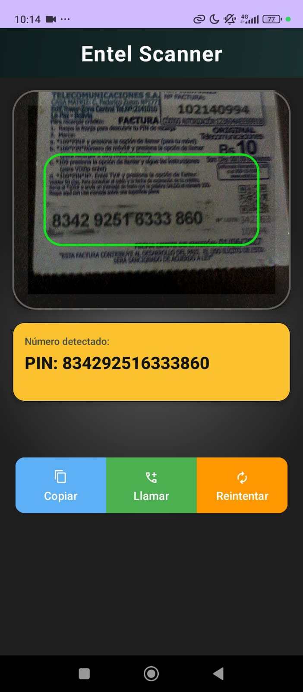

# 📱 Escáner PIN Entel

Aplicación móvil desarrollada en Flutter para escanear y detectar códigos PIN desde tarjetas de recarga utilizando reconocimiento de texto mediante cámara.

---

## 🚀 Características

- Escaneo en tiempo real
- Detección automática de números
- Integración con cámara
- Procesamiento OCR

---

## 🛠️ Tecnologías

- Flutter
- Google ML Kit
- OCR Text Recognition

---

---

## 📸 Capturas


---

## ⚙️ Instalación

```bash
git clone https://github.com/NiwreDev21/scanPIN-Entel.git
cd escaner-pin-entel
flutter pub get
flutter run
```

---

## 📦 APK

```text
./app/release/app-release.apk
```

---

## 👨‍💻 Autor

Erwin Patiño